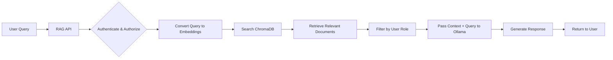

# Understanding RAG and Ollama Model Integration

## Overview

A common question is whether documents indexed in the RAG system become available to all Ollama models. The answer is **NO** - and this is by design. This document explains how the RAG system works with Ollama models and why this separation is important.

## How the RAG System Works

The RAG (Retrieval-Augmented Generation) system uses a specific architecture that keeps your documents separate from the base language models:

### Architecture Components

1. **Document Storage**: Physical files stored in `/documents` folders
   - Organized by category (service, hr, finance, etc.)
   - Access controlled by folder permissions

2. **Vector Database (ChromaDB)**: Stores embeddings of document chunks
   - Enables semantic search
   - Maintains metadata for filtering

3. **Ollama Models**: Base language models without your data
   - gemma3:27b - Main generation model
   - qwen3:30b - Multimodal model
   - snowflake-arctic-embed2:latest - Embedding model

4. **RAG API**: The orchestration layer
   - Handles authentication and authorization
   - Retrieves relevant documents
   - Passes context to models
   - Returns generated responses

## The Retrieval Process



### Step-by-Step Process

1. **User sends query** through the RAG API
2. **Authentication** verifies the user's identity
3. **Authorization** determines which documents they can access
4. **Query embedding** converts the question to vector format
5. **Similarity search** finds relevant documents in ChromaDB
6. **Role filtering** ensures user only sees permitted documents
7. **Context injection** passes documents to the Ollama model
8. **Response generation** creates answer based on provided context
9. **Response delivery** returns the answer to the user

## Key Differences: RAG API vs Direct Ollama

### Through RAG API (HAS Document Access)
```bash
# Documents are retrieved and provided as context
curl -X POST http://localhost:8000/api/query \
  -H "Authorization: Bearer YOUR_TOKEN" \
  -H "Content-Type: application/json" \
  -d '{"query": "What is our company vacation policy?"}'

# Response includes information from your documents
```

### Direct Ollama Usage (NO Document Access)
```bash
# Model has no access to your documents
ollama run gemma3:27b "What is our company vacation policy?"

# Response will be generic, no company-specific information
```

## Why This Separation Matters

### 1. **Security**
- Documents remain protected by role-based access control
- No risk of models "leaking" sensitive information
- Audit trail for all document access

### 2. **Flexibility**
- Update documents without retraining models
- Add/remove documents instantly
- Change access permissions dynamically

### 3. **Scalability**
- Use different models without re-indexing
- Share models across projects safely
- Efficient resource usage

### 4. **Compliance**
- Maintain data governance
- Ensure regulatory compliance
- Control data retention

## Common Misconceptions

### ❌ Myth: "Installing documents makes them part of the model"
**Reality**: Documents are stored separately and only provided as context during queries.

### ❌ Myth: "Ollama models learn from my documents"
**Reality**: Models don't learn or train on your data; they only use it as reference context.

### ❌ Myth: "I need to retrain models when adding documents"
**Reality**: Simply process new documents through the RAG system - no model changes needed.

## Alternative Approaches (Not Recommended)

### Option 1: Fine-tuning Models
```bash
# Would require:
# - Large dataset preparation
# - Significant computational resources
# - Loss of dynamic updates
# - No role-based access control
```

### Option 2: System Prompts
```bash
# Create a model with embedded knowledge
cat > CompanyModel << EOF
FROM gemma3:27b
SYSTEM "You work for ACME Corp. Company policies include..."
EOF

ollama create company-model -f CompanyModel

# Limitations:
# - Static information
# - No access control
# - Size limitations
# - Difficult to update
```

### Option 3: Always Use RAG API ✅ (Recommended)
- Dynamic document access
- Role-based security
- Easy updates
- Audit trails
- Scalable architecture

## Best Practices

### 1. **Always Access Through API**
```python
from examples.api_client import RAGClient

client = RAGClient("http://localhost:8000")
client.login("username", "password")
results = client.query("company information")
```

### 2. **Organize Documents by Category**
```bash
/documents/
├── service/     # General company documents
├── hr/          # HR documents (restricted)
├── finance/     # Financial documents (restricted)
└── legal/       # Legal documents (restricted)
```

### 3. **Regular Index Updates**
```bash
# Process new documents
python src/batch_indexer.py /path/to/new/documents --recursive

# Verify indexing
python src/document_processor.py --stats
```

### 4. **Monitor Access Patterns**
```bash
# Check logs for usage
tail -f logs/api.log | grep "query"

# Audit document access
python src/user_audit.py --report
```

## Troubleshooting

### "Why doesn't Ollama know about my documents?"
- Ensure you're using the RAG API, not direct Ollama
- Verify documents are properly indexed
- Check user has appropriate role permissions

### "How do I make documents permanently available?"
- You don't - this is by design
- Use the RAG API for all queries
- Consider creating API clients for different use cases

### "Can I export knowledge to a model?"
- Not recommended for security reasons
- Would lose access control
- Would require manual updates
- Better to use RAG API consistently

## Summary

The RAG system's architecture intentionally keeps your documents separate from the Ollama models. This provides:

- ✅ **Security**: Role-based access control
- ✅ **Flexibility**: Dynamic document updates
- ✅ **Scalability**: Easy to add new documents
- ✅ **Compliance**: Audit trails and governance
- ✅ **Efficiency**: No model retraining needed

Always access your documents through the RAG API to maintain these benefits. Direct Ollama access will not include your indexed documents, and this separation is a feature, not a limitation.